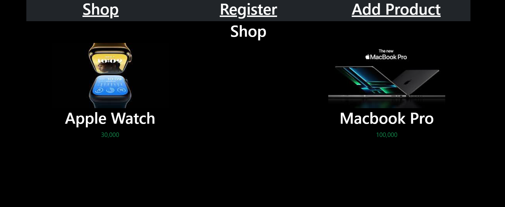
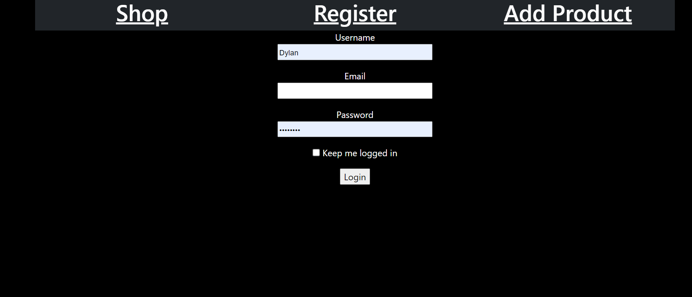
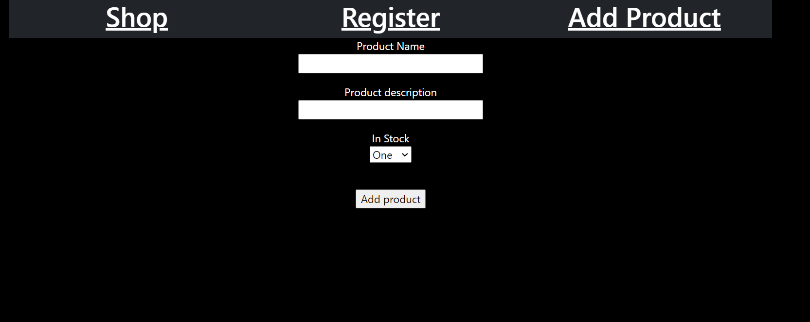

# Working with databases

> This project was about adding users and posts to explain working with databases
> What was used in this project
* html
* flask
* bootstrap
* css
> preview 1

> preview 2

> preview 3
